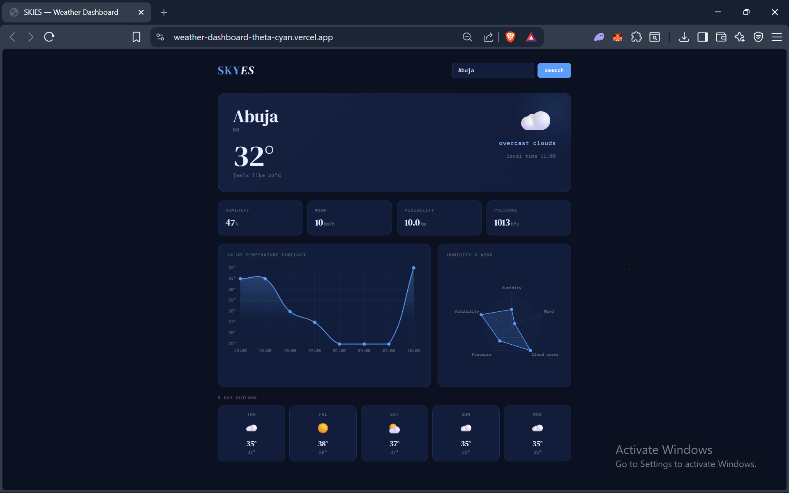

# SKIES —  A Weather Dashboard

A clean, dark-themed weather dashboard built with vanilla JavaScript and Chart.js.

## Live Demo
[weather-dashboard-theta-cyan.vercel.app](https://weather-dashboard-theta-cyan.vercel.app)

## Features
- Real-time weather data via OpenWeatherMap API
- 24-hour temperature forecast line chart
- Humidity, wind, visibility & pressure stats
- 5-day outlook forecast
- Async/await with parallel API calls using Promise.all
- Fully responsive

## Tech Stack
- Vanilla JavaScript (ES6+)
- Chart.js
- OpenWeatherMap API
- HTML/CSS

## Setup
1. Get a free API key from [openweathermap.org](https://openweathermap.org/api)
2. Replace `YOUR_API_KEY` in `index.html`
3. Open in browser or deploy to Vercel